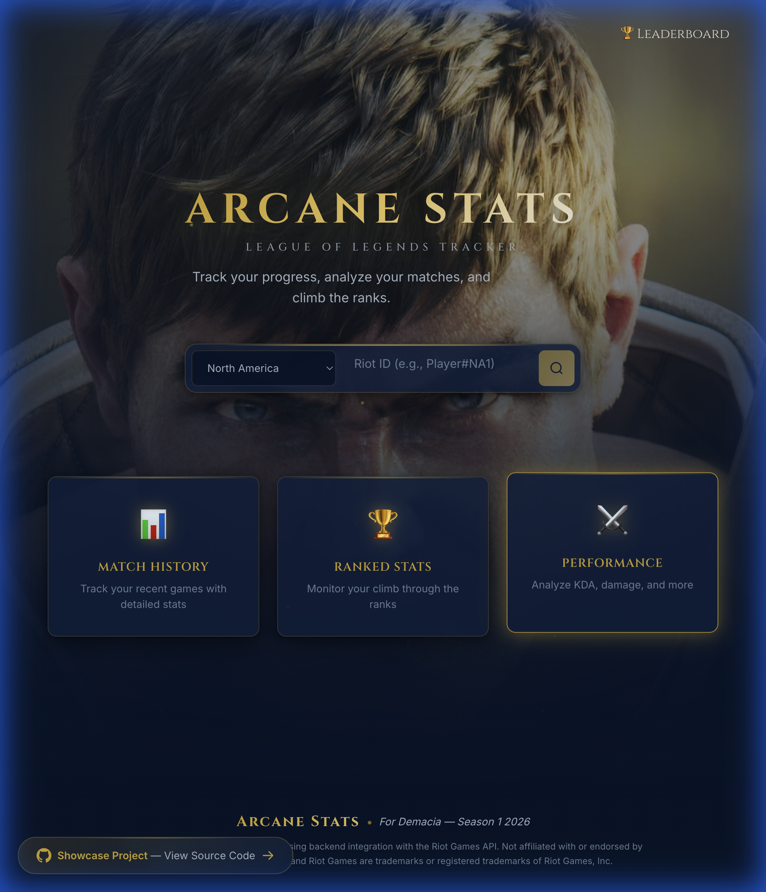

# Arcane Stats - League of Legends Tracker

A premium League of Legends stats tracking application with a beautiful Hextech-inspired UI. Built with NestJS backend and React + Vite frontend. Fully compliant with the latest Riot API v5 standards (Riot ID & PUUID support).



## 🌐 Live Demo

**[https://arcane-stats.jesusjimenez.dev](https://arcane-stats.jesusjimenez.dev)**

## 🚀 Features

- **Summoner Search**: Look up any player by Riot ID (gameName#tagLine)
- **Match History**: View detailed match statistics with expandable cards
- **Ranked Stats**: Track Solo/Duo and Flex queue rankings
- **Performance Analytics**: KDA, damage, and game performance metrics
- **Premium UI**: Hextech Glass design system with particles and animations

## 🏗️ Architecture

```
┌─────────────────────────────────────────────────────────┐
│                    TRAEFIK (HTTPS)                      │
│              arcane-stats.jesusjimenez.dev              │
└─────────────────────────┬───────────────────────────────┘
                          │
                          ▼
┌─────────────────────────────────────────────────────────┐
│                  nginx-gateway:80                       │
│               (Reverse Proxy Router)                    │
├─────────────────────────┬───────────────────────────────┤
│     /api/*              │           /*                  │
│         │               │            │                  │
│         ▼               │            ▼                  │
│    Backend:4000         │      Frontend:80              │
│      (NestJS)           │    (React + nginx)            │
└─────────────────────────┴───────────────────────────────┘
                          │
                          ▼
                 ┌─────────────────┐
                 │  PostgreSQL DB  │
                 └─────────────────┘
```

## 📁 Project Structure

```
arcane-stats/
├── backend/              # NestJS API server
│   ├── src/
│   │   ├── modules/      # Feature modules (summoner, match, league, etc.)
│   │   ├── database/     # TypeORM configuration
│   │   └── scripts/      # Utility scripts (db:sync)
│   └── Dockerfile
├── frontend/             # React + Vite application
│   ├── src/
│   │   ├── components/   # UI components
│   │   ├── hooks/        # Custom React hooks (useFetch, etc.)
│   │   ├── pages/        # Page components
│   │   ├── styles/       # CSS design system
│   │   └── types/        # TypeScript interfaces
│   ├── Dockerfile
│   └── nginx.conf
├── gateway/              # nginx reverse proxy
│   ├── nginx.conf        # Routing rules (/api → backend, / → frontend)
│   └── Dockerfile
├── docker-compose.yml    # Production orchestration
└── .env.example          # Environment template
```

## 🛠️ Quick Start

### Prerequisites

- Node.js 20+
- pnpm (`corepack enable` or `npm install -g pnpm`)
- Docker & Docker Compose
- Riot API Key ([Get one here](https://developer.riotgames.com/))

### Development Setup

1. **Clone the repository**

   ```bash
   git clone <repo-url>
   cd arcane-stats
   ```

2. **Configure environment**

   ```bash
   cp .env.example .env
   # Edit .env and add your RIOT_API_KEY
   ```

3. **Start with Docker Compose**

   ```bash
   docker-compose up --build
   ```

   Or run services manually:

   ```bash
   # Backend
   cd backend && pnpm install && pnpm run start:dev

   # Frontend (in another terminal)
   cd frontend && pnpm install && pnpm run dev
   ```

4. **Access the application**
   - Frontend: http://localhost:3000
   - Backend API: http://localhost:4000/api
   - Swagger Docs: http://localhost:4000/docs

### Production Deployment (Dokploy)

This project is optimized for deployment on **Dokploy** using Docker Compose.

1. Connect your repository to Dokploy
2. Select "Docker Compose" as the deployment type
3. Set Environment Variables in Dokploy UI:
   - `RIOT_API_KEY` (required)
   - `POSTGRES_PASSWORD` (generate a secure one)
   - `TYPEORM_PASSWORD` (same as POSTGRES_PASSWORD)
4. Add domain in Dokploy pointing to the `gateway` service on port 80
5. Deploy!

**Initial Database Setup:**

```bash
# SSH into server and run:
docker exec arcane-backend node dist/scripts/sync-schema.js
```

## 🎨 Design System

The frontend uses the **Hextech Glass** design system:

- **Colors**: Deep backgrounds (#0a0a12) with gold (#c89b3c) and cyan (#0ac8b9) accents
- **Typography**: Cinzel for headings, Inter for body text
- **Effects**: Glassmorphism, particle animations, glowing borders
- **Components**: Glass panels, animated buttons, status indicators

## 📡 API Endpoints

| Endpoint                                       | Description                 |
| ---------------------------------------------- | --------------------------- |
| `GET /api/summoner/:region/:gameName/:tagLine` | Get summoner profile        |
| `GET /api/summary/:region/:gameName/:tagLine`  | Get full player summary     |
| `GET /api/match/:region/:gameName/:tagLine`    | Get paginated match history |
| `GET /api/league/:region/:gameName/:tagLine`   | Get ranked entries          |

Full Postman collection available at `backend/postman_collection.json`

## 🔧 Environment Variables

| Variable              | Description                            | Required            |
| --------------------- | -------------------------------------- | ------------------- |
| `RIOT_API_KEY`        | Your Riot Games API key                | ✅                  |
| `POSTGRES_USER`       | Database username                      | Default: `arcane`   |
| `POSTGRES_PASSWORD`   | Database password                      | ✅                  |
| `POSTGRES_DB`         | Database name                          | Default: `arcane`   |
| `TYPEORM_HOST`        | DB host (use container name in Docker) | Default: `postgres` |
| `TYPEORM_SYNCHRONIZE` | Auto-sync schema (set `false` in prod) | Default: `false`    |

## 📦 Resource Requirements

Optimized for lightweight deployment:

| Service    | Memory Limit | Memory Reservation |
| ---------- | ------------ | ------------------ |
| PostgreSQL | 128MB        | 64MB               |
| Backend    | 256MB        | 128MB              |
| Frontend   | 96MB         | 48MB               |
| Gateway    | 32MB         | 16MB               |
| **Total**  | ~512MB       | ~256MB             |

## 📜 Disclaimer

This project is not endorsed by Riot Games and doesn't reflect the views or opinions of Riot Games or anyone officially involved in producing or managing League of Legends. League of Legends and Riot Games are trademarks or registered trademarks of Riot Games, Inc.

---

Built with ❤️ using NestJS, React, and the Riot Games API.
